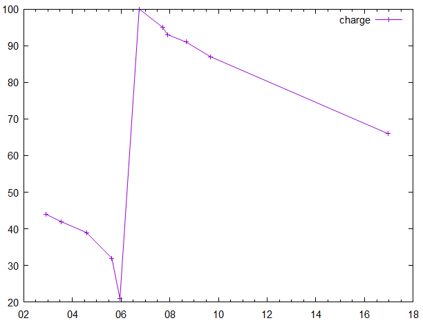

# Hover-exec

This is the README for VS Code extension *hover-exec*. For more detail, [READMORE](READMORE.md).


- [Hover-exec](#hover-exec)
  - [Features](#features)
  - [Basic hover-exec](#basic-hover-exec)
    - [with vscode's eval](#with-vscodes-eval)
    - [Scripts with default command lines](#scripts-with-default-command-lines)
  - [Some examples](#some-examples)
    - [nodejs](#nodejs)
    - [lua](#lua)
    - [python](#python)
    - [julia](#julia)
    - [powershell](#powershell)
    - [gnuplot](#gnuplot)
    - [eval](#eval)
    - [run a server using node](#run-a-server-using-node)
    - [and kill the server with powershell](#and-kill-the-server-with-powershell)
    - [scilab](#scilab)
  - [One-liners](#one-liners)
    - [One-liner examples:](#one-liner-examples)
  - [Configuration settings](#configuration-settings)
  - [Known Issues](#known-issues)
  - [Release Notes](#release-notes)

## Features

*Hover-exec* facilitates execution from within the editor of markdown code blocks in a variety of installed script languages.

The extension is activated when a markdown file is opened in the editor.

Hover script exec in action:
  


## Basic hover-exec 

Hovering over lines starting with ` ``` `  (or starting with a single backtick and including an end one) will trigger a hover message with an *exec* command as the bottom line, as above. Hovering over ` ``` ` at the end of a block will trigger the message for the start of the block. Clicking the command link on the bottom line of the hover message (or using the shortcut `Alt+/` or `Opt+/` with the cursor anywhere in the block) will execute the code in the code block, and produce output.

---
### with vscode's eval

Javascript code blocks can also be executed in *vscode's* internal javascript by using `eval`. Note that using `js` for the codeblock id produces syntax highlighting (it's a quick and dirty approach to provide basic syntax highlighting for a range of scripts), then adding ` :eval` sets the actual exec command to `eval`. Note that `eval` allows the internal vscode API to be used. Variables `a,..,z` have been made available for use by the eval script without fear of overwriting an internal variable. Installation of `nodejs` is not required for `eval` scripts to execute.

```js :eval
'test: '+Math.random() =>> test: 0.021887854277380603
```
Intermediate results can be viewed in line by appending a line with a three character `=>>` . To be compatible with the *markdown preview enhanced* extension (*mpe*) put a 2 character comment character before the `=>>', eg. for javascript use `// =>>', for python '## =>>'.  *mpe* will not update the inline comment. 

---
### Scripts with default command lines

Command lines to start a number of scripts are included:

- eval (built in javascript, with vscode api available)
- javascript (via node)
- html
- powershell
- bash
- zsh
- python
- julia
- octave
- scilab
- gnuplot
- matlab
- lua
- go

The script language you are using (eg `julia`,`nodejs`) needs to have been installed, and ***some of the commands to run the scripts may need customising*** to suit your particular installation - see [Changing script configuration](#changing-script-configuration).

Other script languages may be added - see [Adding another script](#adding-another-script).

## Some examples

### nodejs

The js command by default executes a javascript code block in `nodejs` (assuming that is installed).

```js //will execute if node is installed
// ```js   this comment shows the command in markdown previews`
console.log('  test using node:\n  '+Math.random())
console.log('  Note: hover-exec on ```output line`, or alt+/ (opt+/) with\n',
    ' the cursor in the output block will delete the output block')
```
```output
  test using node:
  0.12995292393011426
  Note: hover-exec on ```output line`, or alt+/ (opt+/) with
  the cursor in the output block will delete the output block
```

---
### lua

```lua --*say hello goodbye*
-- ```lua --*say hello goodbye*
'hello '..(44-2+math.random())=>>hello 42.209272271111
"goodbye "..math.pi+math.random()=>>goodbye 4.0295093638344
print("ok") -- this outputs in the output code block below
```
```output
ok
```

---
### python

```python {cmd}
 # ```python {cmd}  -- {cmd} allows execution in markdown preview enhanced
from random import random
45-2+random()  =>>43.01562724147673
'hello, world 3!'      =>>hello, world 3!
print('ok')
```
```output
ok
```

---
### julia

```julia
 # ```julia
using LinearAlgebra, Statistics, Compat
a=rand(Float64,3);
a      =>>[0.4708568233632755, 0.20839509142886614, 0.21698096687287105]
b=a;b[2]=42;                                   # arrays are shallow copied
println(string("a=",a,"\n","b=",b))  # double quotes only for julia strings
```
```output
a=[0.4708568233632755, 42.0, 0.21698096687287105]
b=[0.4708568233632755, 42.0, 0.21698096687287105]
```

---
### powershell

```pwsh {cmd} // *random number, current dir, ..
 # ```pwsh {cmd} // random number, current dir, ..
Get-Random -Min 0.0 -Max 1.0 =>>0.313258917682459
pwd
```
```output
Path
----
C:\Users\ralph\OneDrive\Documents\GitHub\hover-exec
```

---
### gnuplot

```gnuplot {cmd}
 # ```gnuplot {cmd}
$charge << EOD
2-07-2021 22:32 44
3-07-2021 13:34 42
4-07-2021 14:22 39
5-07-2021 15:10 32
5-07-2021 23:57 21
6-07-2021 18:10 100
7-07-2021 17:02 95
7-07-2021 22:46 93
8-07-2021 16:38 91
9-07-2021 16:08 87
16-07-2021 23:30 66
EOD
set xdata time;
set timefmt "%d-%m-%Y %H%M"
set format x "%d"
set mouse mouseformat 3
plot "$charge" using 1:3 w lp title "charge"
```

 

---
### eval

Some more examples using vscode internal javascript, showing use of vscode api functions and some extra functions  published by `hover-exec` (eg. `alert`)

```js :eval
// ```js:eval -- eval is not available in mpe
let abc="abcde"
let a='hello variable world';
alert(a) //not available in node
a='goodbye'
vscode.window.showInformationMessage(a) //not available in node
eval('let a=3;2*a*Math.random()')=>> 1.1126970236718154
console.log(a,Math.random())
'hello '+(2-1+Math.random())=>> hello 1.0693208939528325
process.cwd() =>> c:\Users\ralph\OneDrive\Documents\GitHub\hover-exec
console.log(abc)
```
```output
goodbye 0.9413534226468123
abcde
```

---

```js :eval -- javascript regex tester
// ```eval -- javascript regex tester
'abcdefg'.replace(/^.*(bc)/,'$1--') //= bc--defg 
```

---
### run a server using node

```js //run server at http://127.0.0.1:1337  ctrl click to open server>
var http = require('http');
http.createServer(function (req, res) {
        res.writeHead(200, {'Content-Type': 'text/plain'});
        res.end('Hello World at last!\n');
}).listen(1337, "127.0.0.1");
```

---
### and kill the server with powershell

```pwsh # kill server through powershell
 # ```pwsh # kill server through powershell
 # to kill server, exec once & look for pid to kill (line TCP 127.0.0.1:1337 on rhs)
 # then enter pid in kill statement below and exec again
kill 14452
netstat -ano | findstr :13
```

---
### scilab

```js :scilab {cmd=scilab} 
// ```js :scilab {cmd=scilab} 
// using js :scilab instead of just ```scilab provides quick & dirty syntax highlight
// {cmd=scilab} is for markdown preview enhanced
rand("seed",getdate('s'));
'def '+string(rand())+' abc'=>>def 0.8770073 abc
// nb. need to use 'string' for numeric output in scilab
disp('random: '+string(rand()))
```
```output
  "random: 0.5997802"
```
---
## One-liners

*One-liners* starting and ending with a single backtick  ` ` ` (and starting in col 1) can also be executed on hover-click. The pre-defined variables %c current folder, %f temp file full path+name, %p temp file path, %n temp file name can be used. Comments can be added after the closing quote.

### One-liner examples:

exec notepad with file in current folder:
`notepad %cREADME.md`

exec notepad with temp file (%f):
`notepad %f`

exec notepad++:
`"C:/Program Files/Notepad++/notepad++" %cREADME.md`

explore 'This pc':
`explorer ,`>

explore folder:
`explorer /select, %cREADME.md`>

show devices:
`devmgmt.msc`

open default browser with href, or showing html text (note that html is a built in script command, see previous section)

`html <script>location.href= 'https://whatamigoingtodonow.net/'</script>`

`html <h1>Hello world!</h1>`

## Configuration settings

The startup commands for scripts included by default are as follows (nb. `%f` provides the appropriate temporary file path & name, and the notation `%f.py`, for example, indicates that the temporary file extension `.py` should be used - the default is `.txt` ):

  "octave":"octave \"%f.m\"",
  "matlab":"matlab -sd %p.m -batch temp",
  "matlab_comment":"if %p.m needs to be \"%p.m\" then add /, ie. \"%p.m/\" ",
  "scilab":"scilex -quit -nb -f \"%f.sci\" ",
  "python":"python \"%f.py\"",
  "python3":"python3 \"%f.py\"",
  "streamlit":"streamlit run \"%f.py\" ",
  "julia":"julia \"%f.jl\"",
  "gnuplot":"gnuplot -p -c \"%f.gp\"",
  "pwsh":"pwsh -f \"%f.ps1\"",
  "bash":"bash \"%f.sh\"",
  "zsh":"zsh -f \"%f.sh\"",
  "lua54":"lua54 \"%f.lua\"",
  "lua53":"lua53 \"%f.lua\"",
  "lua":"lua54 \"%f.lua\"",
  "js":"node \"%f.js\"",
  "eval":"eval",
  "node":"node \"%f.js\"",
  "javascript":"node \"%f.js\"",
  "html":"\"%f.html\"",
  "firefox":"firefox \"%f.html\"",
  "chrome":"google-chrome-stable \"%f.html\"",
  "test":"test -c \"%f.tst\"",
  "go":"go run \"%f.go\"",
  "buddvs":"buddvs \"%f.txt\" "

Any of these can be changed to suit the system in use using vscode `settings`.

There is also a set of strings called `swappers` which enable moving the output of a line so that it appears *in-line*, within the codeblock itself. Check the  [READMORE](READMORE.md).

## Known Issues

This is a beta version.

Note that in all scripting languages included (except the 'home-grown' one buddvs), the script starts from scratch when the code block is executed, the same as if the command file were executed from scratch from the command prompt. In other words, assigned variables do not carry over into the next script execution. This kind of approach is best suited for small scripts to demonstrate or highlight language features, provide quick reference, or show comparisons between scripting languages.

Matlab takes a substantial amount of time to run a codeblock (ie. the startup time for matlab to run a 'batch file' is nearly 10s on my Ryzen pc). However, other included scripts are generally fairly fast (see the demo gif above).

## Release Notes

Initial beta release was 0.4.1
Published using: vsce package/publish
