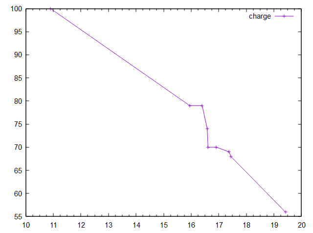

# Hover exec

This is the README for VS Code extension *hover exec* for viewing in a markdown previewer.

## Features

*Hover-exec* facilitates execution (from the editor) of markdown code blocks in a variety of installed scripts.

The extension is activated when a markdown file is opened in the editor.

Hover script exec in action:


### Basic hover-exec 
Hovering over lines starting ``` will trigger a hover message with an *exec* command as the bottom line. Clicking the *exec* command will execute the code in the code block, and produce output if directed:

        ```js
        'test using node: '+Math.random()=>>test using node: 0.4007943
        ```

The js command by default executes a javascript code block in nodejs (assuming that is installed). Javscript code blocks can aslo be executed in the vscode's internal javascript through an `eval` - note that using `js` for the codeblock produces the syntax highlighting, but setting `{cmd=eval}` resets the exec command to `eval`. Note that this use of `eval` does not allow variables to be defined, but the vscode API can be used.

        ```js {cmd=eval}
        'test: '+Math.random()=>>test: 0.5142428
        ``` 

Intermediate results can be viewed in line, as above, by appending a line with a predefined three character string. The string `=>>` can always be used, so long as it is used consistently throughout the script. For the predefined scripting languages, the preferred 3 char string (shown on hover) starts with a comment indicator and ends with `=` (eg. `##=` for python). This is preferred because it is compatible with the *markdown preview enhanced* extension (any existing intermediate output will be treated as a comment).

Note that in the above, the script is an `eval` script (`cmd=eval`), and executed internally by *hover-exec*. Starting the line with `js` allows vscode to provide javascript syntax highlighting.

### Some examples

```lua --*say hello goodbye*
print("hello") -- this outputs in the output code block below
'hello '..(44-2+math.random())=>>hello 42.828019207949
"goodbye "..math.pi+math.random()=>>goodbye 3.2172013694041
```
```output
hello
```

```python
from random import random
45-2+random()                  =>>43.00423890354297
'hello world!'                      =>>hello world!
```

```julia
using LinearAlgebra, Statistics, Compat
a=rand(Float64,3);
a                               ##=[0.36814812612868586, 0.6866911978473123, 0.05644257070215741]
nb=a;nb[2]=42;        # arrays are shallow copied
a                               ##=[0.36814812612868586, 42.0, 0.05644257070215741]
nb                            ##=[0.36814812612868586, 42.0, 0.05644257070215741]
```

```matlab  --matlab is slow to start (this takes nearly 10s on Asus with Ryzen 7 4700U)
7*7-7 %%=42
```

```pwsh {cmd} //*random & dir list*
Get-Random -Min 0.0 -Max 1.0 =>>0.124692752084086
"current dir: "+(pwd)   =>>current dir: C:\Users\xxx\.vscode\extensions\rmzetti.hover-exec
Get-Variable c*
```
```output
Name                           Value
----                           -----
ConfirmPreference              High
```

```gnuplot 
$charge << EOD
10-06-2021 2138 100
15-06-2021 2247 79
16-06-2021 0935 79
16-06-2021 1400 74
16-06-2021 1439 70
16-06-2021 2157 70
17-06-2021 0900 69
17-06-2021 1037 68
19-06-2021 1000 56
set xdata time;
set timefmt "%d-%m-%Y %H%M"
set format x "%d"
set mouse mouseformat 3
plot "$charge" using 1:3 w lp title "charge"
```




```js {cmd=eval}
//can't use variables in main, but can use inside another eval as below
eval('let a=3;2*a*Math.random()')=>>5.8765482353295715
vscode.window.showInformationMessage("Hello World") //vscode api call produces popup message
'hello '+(2-1+Math.random())=>>hello 1.8956467731272915
```

```eval javascript regex tester
'abcdefg'.replace(/^.*(bc)/,'$1--') //=bc--defg
```

```js //run server at http://127.0.0.1:1337  ctrl click to open server>
var http = require('http');
http.createServer(function (req, res) {
    res.writeHead(200, {'Content-Type': 'text/plain'});
    res.end('Hello World at last!\n');
}).listen(1337, "127.0.0.1");
```

```pwsh # kill server through powershell
# to kill server, exec once & look for pid to kill (line TCP 127.0.0.1:1337 on rhs)
# then enter pid in kill statement below and exec again
kill 14452
netstat -ano | findstr :13
```

```js {cmd=scilab} 
//using the above instead of just ```scilab provides quick & dirty syntax highlight
//need to use 'string' for numeric output
rand("seed",getdate('s'));
'def '+string(rand())+' abc'=>>def 0.4897686 abc
disp('random: '+string(rand()))
```

### One-liners

*One-liners* starting and ending with ` ``` ` will simply be executed on click, and do not produce output. The pre-defined variables (%c current folder, %f temp file full path+name, %p temp file path, %n temp file name) can be used, and notes/comments can be added after the closing quotes, for example:

exec notepad++:

        ```"C:/Program Files/Notepad++/notepad++" %ctest.md```

exec notepad with file in current folder:

        ```notepad %ctest.md```

exec notepad with temp file:

        ```notepad %f```

explore 'This pc':

        ```explorer ,```

explore folder:

        ```explorer /select, "C:\Users\xxx\Documents\Notes"```

show printers:

        ```explorer ::{21ec2020-3aea-1069-a2dd-08002b30309d}\
                ::{2227a280-3aea-1069-a2de-08002b30309d}```

show devices:

        ```devmgmt.msc```

exec default browser with href, or showing html text (note html is a built in script command, see above)

        ```html <script>location.href='https://whatamigoingtodonow.net/'</script>```

        ```html <h1>Hello world!</h1>```

exec notepad with some text:

        ```notepad
        This is some text
        and this
        ```

### Scripts supported after hover-exec installation

The following scripts are supported 'out of the box':

- javascript (via node)
- html
- powershell
- python
- julia
- octave
- scilab
- gnuplot
- matlab
- lua
- eval (javascript internal to the extension, with vscode api available)

## Adding more scripts

Other scripts can be added by providing an id & four strings for *Hover exec* in  `settings.json` (see below). 
Essentially if a program can be run with 'batch file' input, and outputs to the command line (if required), it will work in *hover-exec* with the appropriate string definitions.

## Requirements

The script languages to be used (eg. *python*, *gnuplot*, etc) should be installed, and on the path.. eg. on Windows the python repl should run if `python` is entered in a cmd/powershell window.

## Extension Settings

This extension contributes the following settings:

`"hover-exec.selectOnHover"`: select code on hover, default:false

To add further scripting languages, identified by `hover-exec.id`, four strings are required for each:

[0] the javascript exec command to run the script from a temp file
--- the variable `%f` will provide the appropriate temp file name and path

[1] a script command which will change working folder at execution start
--- the variable `%c` provides the path of the current folder

[2] a string of the form `##=print('{{'+str($1)+'}}')`.
--- The first `3 chars` will indicate where in-line output is required (usually begins with the scripting language comment signifier, and ends with `=`).
--- This is followed by a command string, in the appropriate scripting language, to give output in the form `{{$1}}` to enable the extension to move the output to end of the line where it is required.

[3] an optional string to provide the script file used in the form `name.ext`
--- The default is `temp.txt`.
--- As an example, for Matlab (and Octave) `temp.m` is used.

In the strings, the following predefined strings can be embedded
> %f `full_path/name.ext` of temporary file to be used for the script
> %p `full_path` for temporary file (ends with /)
> %n `name.ext` of temporary file
> %c `full_path` of folder containing the original script (ends with `/`)
> %r `3 char string` marking in-line result, eg //= (will be a comment in the script)

The easiest way to add a new script language is to (1) open `settings/extensions/hover-exec`, (2) copy and paste an existing script setting, (3) change the id (`hover-exec.id`), and (4) change the strings as appropriate (see above).

All strings are quoted using double quotes (json standard) so internal quotes should be `'` (ie. single quote) or `\"` (ie. escaped double quote).

Following are the strings for the currently included scripts:

```
"contributes": {
"configuration": {
"type":"object",
"title":"Hover Exec",
"properties": {
        "hover-exec.octave":{
                "type":"array",
                "default":[
                        "octave \"%f\"",
                        "cd \"%c\";",
                        "%%=disp(['{{' $1 '}}'])" ,
                        "temp.m" ],
                "description": "octave",
                "comment":"note double quotes in quotes are escaped"
        },
        "hover-exec.matlab":{
                "type":"array",
                "default":[
                        "matlab -sd \"%p\" -batch temp",
                        "path(path,\"%c\");",
                        "%%=disp([\"{{\"+($1)+\"}}\"])",
                        "temp.m" ],
                "description": "matlab"
        },
        "hover-exec.scilab":{
                "type":"array",
                "default":[
                        "scilex -quit -nb -f \"%f\" ",
                        "cd \"%c\";",
                        "//=mprintf('%s\\n','{{'+$1+'}}')" ,
                        "temp.sci" ],
                "description": "scilab"
        },
        "hover-exec.python":{
                "type":"array",
                "default":[
                        "python \"%f\"",
                        "import os\nos.chdir(\"%c\");",
                        "##=print('{{'+str($1)+'}}')" ,
                        "temp.py" ],
                "description": "python"
        },
        "hover-exec.python3":{
                "type":"array",
                "default":[
                        "python3 \"%f\" ",
                        "import os\nos.chdir(\"%c\");",
                        "##=print('{{'+str($1)+'}}')" ,
                        "temp.py" ],
                "description": "python"
        },
        "hover-exec.julia":{
                "type":"array",
                "default":[
                        "julia \"%f\"",
                        "cd(\"%c\")",
                        "##=println(string(\"{{\",$1,\"}}\"))" ,
                        "temp.jl" ],
                "description": "julia"
        },
        "hover-exec.gnuplot":{
                "type":"array",
                "default":[
                        "gnuplot -p -c \"%f\"",
                        "set loadpath \"%c\"",
                        "" ,
                        "temp.gp" ],
                "description": "for gnuplot no results are returned"
        },
        "hover-exec.pwsh":{
                "type":"array",
                "default":[
                        "pwsh -f \"%f\"",
                        "cd \"%c\";",
                        "##='{{'+($1)+'}}'" ,
                        "temp.ps1" ],
                "description": "powershell"
        },
        "hover-exec.bash":{
                "type":"array",
                "default":[
                        "bash \"%f\"",
                        "cd \"%c\";",
                        "##='{{'+($1)+'}}'" ,
                        "temp.ps1" ],
                "description": "powershell"
        },
        "hover-exec.zsh":{
                "type":"array",
                "default":[
                        "pwsh -f \"%f\"",
                        "cd \"%c\";",
                        "##='{{'+($1)+'}}'" ,
                        "temp.ps1" ],
                "description": "powershell"
        },
        "hover-exec.lua":{
                "type":"array",
                "default":[
                        "lua54 \"%f\"",
                        "",
                        "--=print('{{'..($1)..'}}')" ,
                        "temp.lua" ],
                "description": "lua"
        },
        "hover-exec.js":{
                "type":"array",
                "default":[
                        "node \"%f\"",
                        "process.chdir(\"%c\")",
                        "//=console.log('{{'+($1)+'}}')" ,
                        "temp.js" ],
                "description": "javascript node"
        },
        "hover-exec.html":{
                "type":"array",
                "default":[
                        "\"%f\" ", "", "",
                        "temp.html" ],
                "description": "html",
                "comment":"for html no results are returned"
        },
        "hover-exec.firefox":{
                "type":"array",
                "default":[
                        "firefox \"%f\"", "", "",
                        "temp.html" ],
                "description": "html",
                "comment":"for html no results are returned"
        },
        "hover-exec.eval":{
                "type":"array",
                "default":[
                        "",	"", 
                        "//='{{'+($1)+'}}'" ],
                "description": "eval"
        },
        "hover-exec.selectOnHover":{
                "description": "select code on hover",
                "default": false,
                "type": "boolean"
        },
        "hover-exec.buddvs":{
                "type":"array",
                "default":[
                        "buddvs \"%f\" ",
                        "chdir(\"%c\");",
                        "//=write('{{'+($1)+'}}')" ],
                "description": "budd script"
                "comment":"specialised local scripting language for testing"
        }
}
}
},
````

## Known Issues

This is a beta version.

If the edit file is clicked randomly (or a new hover is activated) during script execution (usually seconds) output is cancelled to avoid it being written in the wrong part of the file.

Note that in all scripting languages included, the script starts from scratch when the code block is executed, the same as if the command file were executed by a REPL from the command prompt. Assigned variables do not carry over into the next script execution. This kind of approach is best suited for useful small scripts to demonstrate or highlight language features, provide quick reference, or show comparisons between scripting languages.

Matlab takes a substantial amount of time to run a codeblock (ie. the startup time for matlab to run a 'batch file' is nearly 10s on my Ryzen pc). The others are generally fairly fast (see the demo gif above).

## Release Notes

### 0.3.6

Initial beta release
Published using: vsce package/publish
